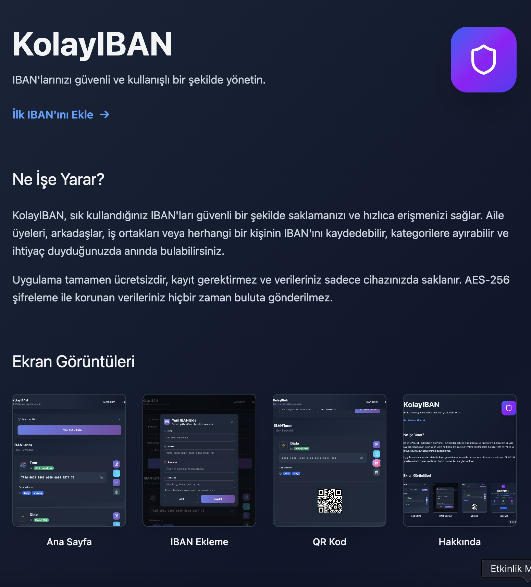

# KolayIBAN - Secure IBAN Management

A secure IBAN management application. Users can safely store and quickly access IBAN information for themselves or others.

## 🚀 New Features

### 🎨 About Page
- **Elegant Design**: Modern and engaging corporate design
- **Hero Section**: Impressive landing section with CTA button
- **Feature Showcase**: Detailed feature cards and descriptions
- **How It Works**: 3-step usage guide
- **Mobile Optimization**: Perfect appearance on all devices

### ⚡ Route Animations
- **Smooth Transitions**: Page transition animations with Framer Motion
- **Fade Effects**: Soft opacity transitions
- **Responsive Animations**: Compatible on all devices

## Features

### 🔐 Security
- **AES-256 Encryption**: IBAN information is protected with the most secure encryption
- **Local Storage**: Data is stored encrypted on the device
- **Offline Security**: Secure access even without internet

### 📱 Mobile App Experience
- **PWA Support**: Can be added to home screen
- **Offline Operation**: Works without internet connection
- **Responsive Design**: Perfect appearance on all devices
- **Theme Support**: Light/dark theme and system theme support
- **Touch Optimized**: Optimized for mobile devices

### 💳 IBAN Management
- **Auto Format**: IBANs are automatically formatted
- **Advanced Validation**: Special validation for Turkish IBANs
- **Auto Bank Detection**: Bank is automatically detected when IBAN is entered
- **Turkish Banks Support**: Automatic recognition for 19+ Turkish banks
- **QR Code**: QR code generation and sharing for IBANs

### 🔍 Smart Search and Filtering
- **Advanced Search**: Search in names, descriptions, and tags
- **Bank Filter**: Filter by bank name
- **Tag System**: Categorize IBANs
- **Quick Filters**: Fast access for popular categories

### 📋 Quick Access
- **One-Click Copy**: Copy IBANs to clipboard
- **QR Code Scanning**: Share IBANs via QR code
- **Quick Editing**: Easy editing and deletion
- **Visibility Control**: Hide/show IBANs

## Screenshots

## Usage

### 🏠 Home Page
1. **Add IBAN**: Click the "Add IBAN" button
2. **Search**: Use the search box at the top
3. **Filter**: Filter using the bank dropdown
4. **Copy**: Click the copy icon on the IBAN card
5. **QR Code**: Click the QR code icon to view QR code

### 📖 About Page
- **Project Introduction**: Detailed feature explanations
- **How It Works**: 3-step usage guide
- **Quick Start**: Start immediately with "Add Your First IBAN" button

### 🔧 Adding IBAN
- **Name** (required): Name to identify the IBAN
- **IBAN** (required): Automatically formatted and validated
- **Bank Name**: Automatically detected
- **Description**: Optional detailed information
- **Tags**: For categorizing

## Technologies

- **React 19**: Modern React hooks and functional components
- **React Router**: Page routing and animations
- **Framer Motion**: Smooth animations and transitions
- **Vite**: Fast build tool
- **Tailwind CSS**: Utility-first CSS framework
- **Lucide React**: Modern icon set
- **CryptoJS**: AES-256 encryption
- **QRCode.react**: QR code generation
- **IBAN**: IBAN validation and formatting
- **React Hot Toast**: Notifications

## Security

- **AES-256 Encryption**: Most secure encryption standard
- **Local Storage**: Data is never sent to the cloud
- **Offline Operation**: No internet dependency
- **Privacy**: All data stays on your device

## PWA Features

- **Add to Home Screen**: App-like usage on mobile devices
- **Offline Operation**: Full functionality without internet
- **Push Notifications**: Coming soon
- **App-like Experience**: Native app experience

## Performance

- **Fast Loading**: Optimized build with Vite
- **Smooth Animations**: 60fps animations
- **Responsive Design**: Fast operation on all devices
- **Memory Efficient**: Low memory usage

## License

MIT License

## Support

- **GitHub Issues**: For issues
- **GitHub Discussions**: For suggestions and discussions
- **Email**: karacuhaa58@gmail.com

---

**KolayIBAN** - Store your IBANs securely, access them quickly! 🔐💳
