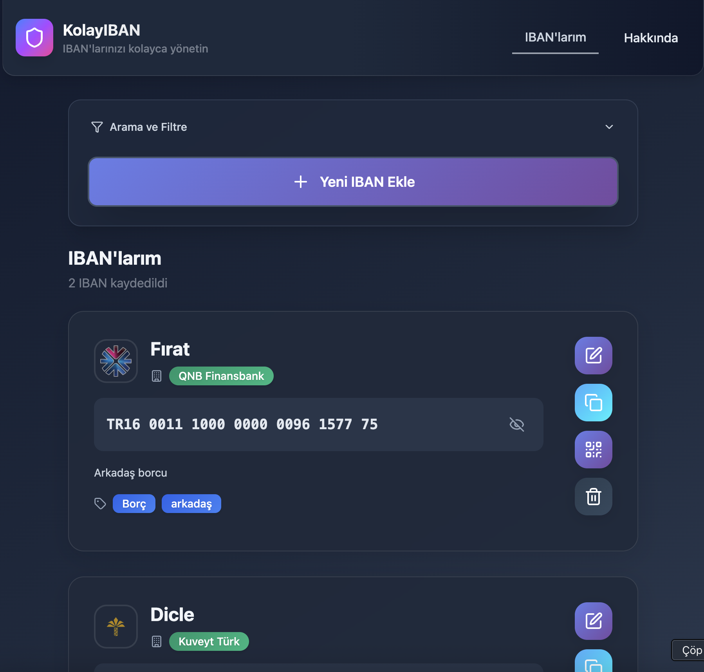
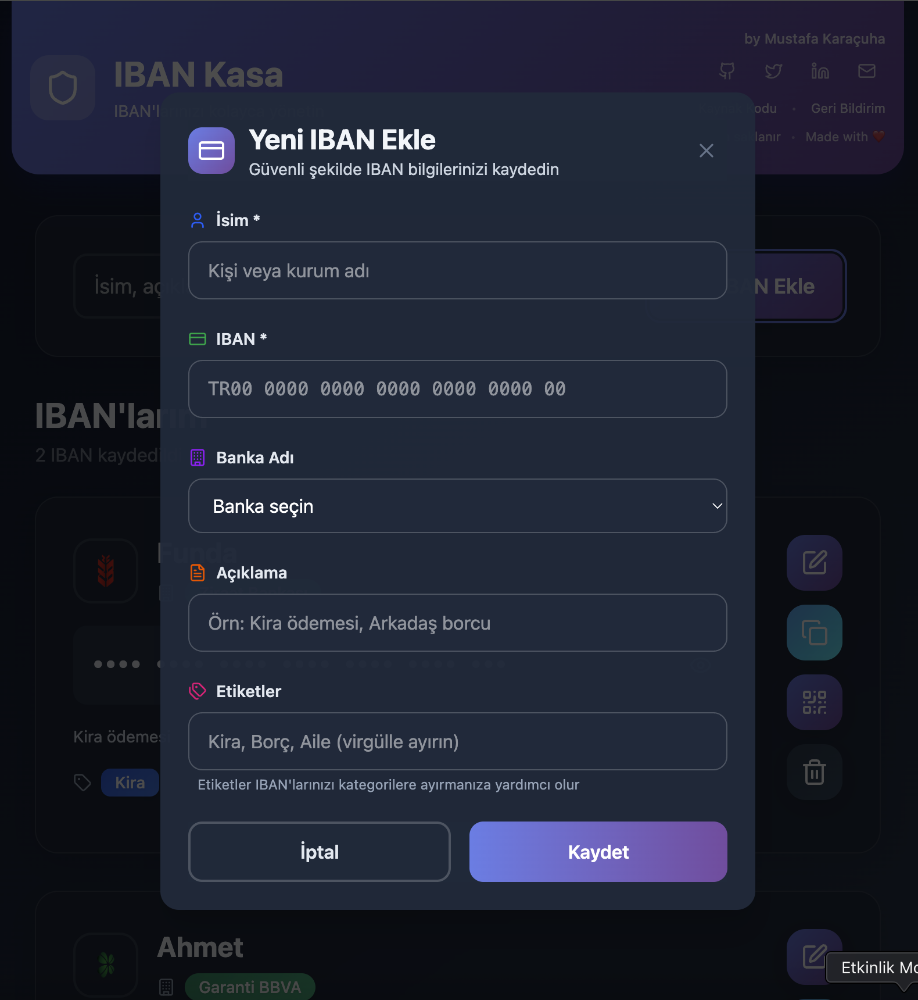
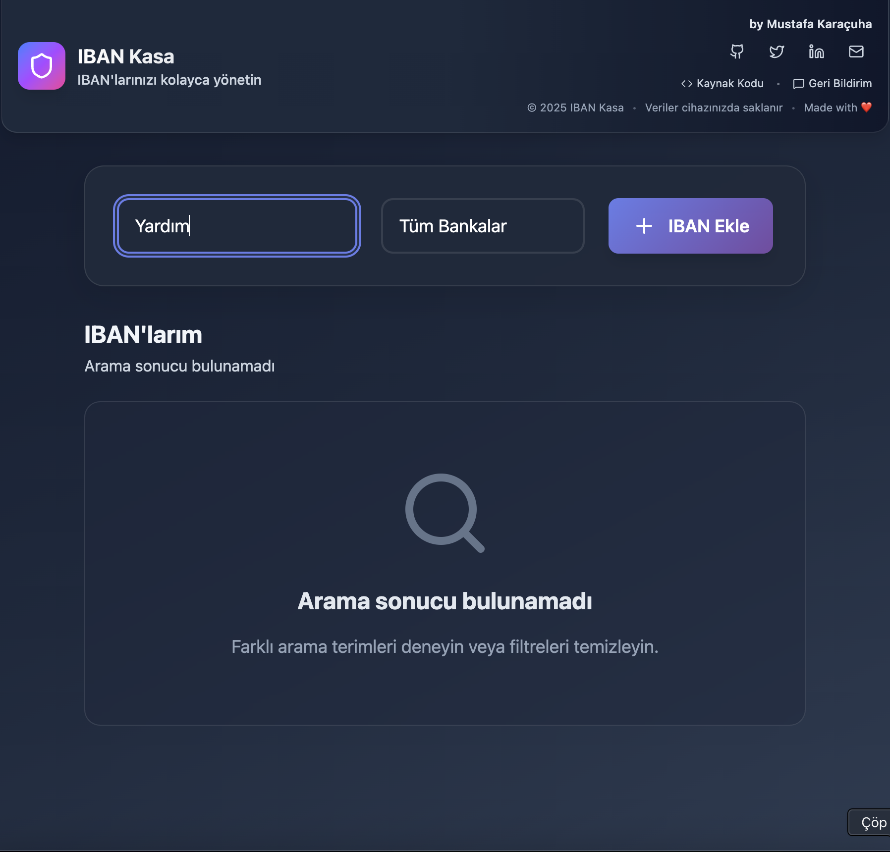
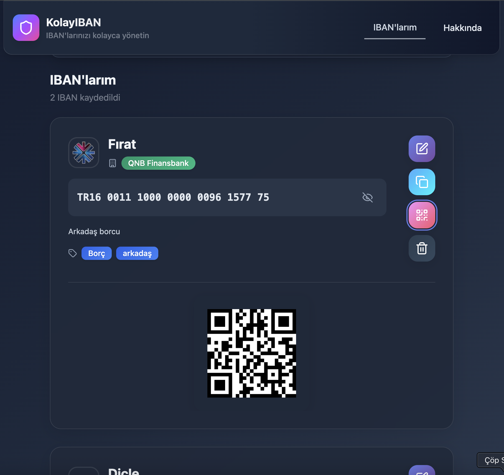

# IBAN Kasa - Güvenli IBAN Kasası

Güvenli IBAN yönetimi uygulaması. Kullanıcılar kendi veya başkalarına ait IBAN bilgilerini güvenli şekilde kaydedip hızlıca erişebilirler.

## Özellikler

### 🔐 Güvenlik
- **Şifreleme**: IBAN bilgileri AES şifreleme ile güvenli şekilde saklanır
- **Yerel Depolama**: Veriler cihazda şifrelenmiş olarak saklanır

### 📱 Mobil Uygulama Deneyimi
- **PWA Desteği**: Ana ekrana eklenebilir
- **Offline Çalışma**: İnternet olmadan da kullanılabilir
- **Responsive Tasarım**: Tüm cihazlarda mükemmel görünüm
- **Tema Desteği**: Açık/koyu tema ve sistem teması desteği

### 💳 IBAN Yönetimi
- **Otomatik Format**: IBAN'lar otomatik olarak formatlanır
- **Doğrulama**: IBAN formatı otomatik kontrol edilir
- **Otomatik Banka Tespiti**: IBAN girildiğinde banka otomatik algılanır
- **Türk Bankaları Desteği**: 19+ Türk bankası için otomatik tanıma
- **QR Kod**: IBAN'lar için QR kod oluşturma

### 🔍 Arama ve Filtreleme
- **Akıllı Arama**: İsim, açıklama ve etiketlerde arama
- **Banka Filtresi**: Banka adına göre filtreleme
- **Etiket Sistemi**: IBAN'ları kategorilere ayırma

### 📋 Hızlı Erişim
- **Tek Tıkla Kopyalama**: IBAN'ları panoya kopyalama
- **QR Kod Tarama**: IBAN'ları QR kod ile paylaşma
- **Hızlı Düzenleme**: Kolay düzenleme ve silme

## Ekran Görüntüleri

## Kullanım

1. **İlk Kullanım**: Uygulamayı açın ve "IBAN Ekle" butonuna tıklayın
2. **IBAN Ekleme**: 
   - İsim (zorunlu)
   - IBAN (zorunlu, otomatik formatlanır)
   - Banka adı (otomatik tespit edilir)
   - Banka görseli (otomatik tespit edilir)
   - Açıklama ve etiketler (opsiyonel)
3. **Arama**: Üst kısımdaki arama kutusunu kullanın
4. **Filtreleme**: Banka dropdown'ından filtreleme yapın
5. **Kopyalama**: IBAN kartındaki kopya ikonuna tıklayın
6. **QR Kod**: QR kod ikonuna tıklayarak QR kod görüntüleyin

## Teknolojiler

- **React 19**: Modern React hooks ve functional components
- **Vite**: Hızlı build tool
- **Tailwind CSS**: Utility-first CSS framework
- **Lucide React**: Modern icon set
- **CryptoJS**: AES şifreleme
- **QRCode.react**: QR kod oluşturma
- **IBAN**: IBAN doğrulama ve formatlama
- **React Hot Toast**: Bildirimler

## Güvenlik

- Tüm IBAN verileri AES-256 şifreleme ile korunur
- Veriler hiçbir zaman buluta gönderilmez
- Offline çalışma ile internet bağımlılığı yok

## PWA Özellikleri

- Ana ekrana eklenebilir
- Offline çalışma

## Lisans

MIT License

## Destek

Sorunlar için GitHub Issues kullanın.
